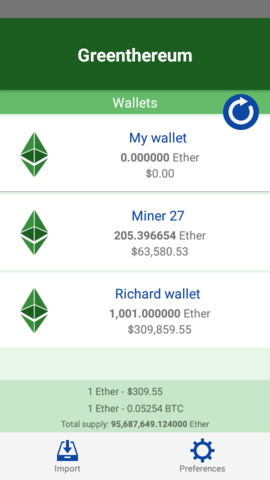

# Greenthereum (working PoC)
  

Free and **Open Source** [Ethereum](https://ethereum.org/) tracker and account explorer app, built with [React Native](https://facebook.github.io/react-native/) for **Android - iOS**.     

In a nutshell this app will give you access to follow and track your ethereums accounts activities and info in different currencies.  
**Important**: We will **never** ask for your **private** key, we don't need it, we only access the open information in the blockchain with your **public address**.

   

### Features
- See any ethereum account **balance**
- Watch all your ethereum accounts in **one place**
- **No Ads** (we hate ads too)
- **Elegant** design
- See last **transactions** inside the app
- Work **offline** with the last data available
- Support for 32 currencies
- Free and **Open Source**, help us improve it

### Getting Started

#### Prerequisites
- [node](https://nodejs.org/en/download/) 6.11.x
- [expo app](https://play.google.com/store/apps/details?id=host.exp.exponent&referrer=www)

#### Installing
- First clone this repository:   
  `$ git clone <url>`   
- `$ cd greenthereum/`
- `$ npm install`
- Install the [expo client](https://expo.io/):  
  `$ npm install exp --global`

#### Run (development)
- Read official docs for your OS (step 1 and 2): [Running On Device](https://facebook.github.io/react-native/docs/running-on-device.html)
- Open `ETHERSCAN_API.json` and set your own `KEY` to have access to the etherscan.io public API
- `$ npm run start` see the *package.json* for more options
- Follow the **instructions** given

#### Running the tests
- `$ npm test` will run all tests

### Contributing
- If you are **not a developer**, you can contribute the project simply by installing the **app** in your smartphone and give us **feedback**, help us with **new ideas**, or just donate to us, **donations** help keep the project in the long future.
- If you are a **developer** Pull Request are very welcome, please see our guides to contribute.

### Donations
Address:  
**0x4d6b58C363B900369fC0293573540166b6199250**  

### Special thanks to
- All the contributors
- [etherscan.io](https://etherscan.io/) APIs
- [fixer.io](https://github.com/hakanensari/fixer) project
- Iconfinder and [yanlu](https://www.iconfinder.com/yanlu), [martin.allie](https://www.iconfinder.com/martin.allien)  
- [flaticon](https://www.flaticon.com/)
### License

This project is licensed under the **MIT License** © [@juliomatcom](https://twitter.com/juliomatcom)
